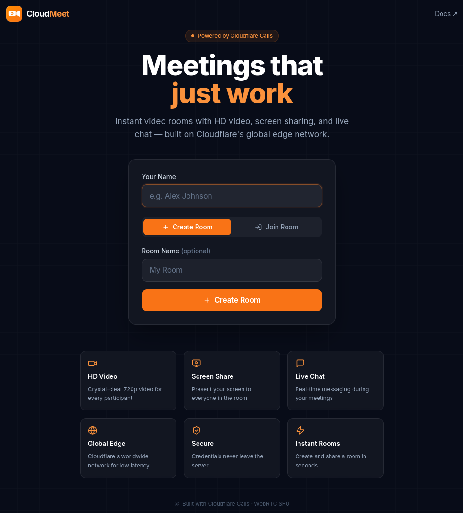

# CloudMeet

[](https://deploy.workers.cloudflare.com/?url=https://github.com/manalejandro/cf-realtime)
[](LICENSE)

> Real-time video meetings powered by the [Cloudflare Calls API](https://developers.cloudflare.com/calls/).

CloudMeet lets users **create** and **join** video meeting rooms with HD video, screen sharing, and live in-room chat — all running on Cloudflare's global edge network using native WebRTC via the Cloudflare Calls SFU.

**Repo:** <https://github.com/manalejandro/cf-realtime>  



---

## Features

- **Create rooms** — generate a unique meeting room in one click
- **Join rooms** — share the room code or link with anyone
- **HD Video** — multi-participant video grid with dynamic layout
- **Microphone & Camera** — hardware toggle controls
- **Screen Sharing** — share your screen natively via the browser
- **Live Chat** — persistent in-room chat over WebSocket
- **Global Edge** — powered by Cloudflare Workers, Durable Objects & Calls API
- **Beautiful UI** — dark glassmorphism design, fully responsive

---

## Tech Stack

| Layer | Technology |
|---|---|
| Frontend | React 18, TypeScript, Vite |
| Styling | Tailwind CSS 3, custom glass-morphism |
| WebRTC | Native browser APIs + Cloudflare Calls SFU |
| Signaling | Durable Objects + WebSocket |
| Backend | Cloudflare Workers (TypeScript) |
| Deployment | Wrangler v3, Cloudflare Workers + Assets |

---

## How it works

CloudMeet uses the **two-PeerConnection architecture** recommended by Cloudflare Calls:

1. **`sendPC`** — pushes your local audio/video/screen tracks to Cloudflare's SFU
2. **`recvPC`** — pulls all remote participants' tracks from the SFU
3. **Durable Object (`RoomDO`)** — WebSocket hub that broadcasts participant track info
4. When a participant joins, their track locators are broadcast and every other participant pulls them via `recvPC`

All SFU calls go through the Worker proxy (`/api/calls/…`) to keep your `CALLS_APP_TOKEN` secret.

---

## Project Structure

```
cf-realtime/
├── index.html              # Vite SPA entry
├── vite.config.ts
├── tsconfig.json
├── tailwind.config.ts
├── wrangler.jsonc          # Cloudflare Worker config
├── public/
│   └── index.html
├── src/
│   ├── main.tsx            # React root
│   ├── App.tsx             # Router
│   ├── index.css           # Tailwind + custom styles
│   ├── pages/
│   │   ├── LobbyPage.tsx   # Create / join room
│   │   └── MeetingPage.tsx # In-meeting view
│   ├── components/
│   │   ├── Logo.tsx        # SVG logo component
│   │   ├── MeetingRoom.tsx # Video grid + controls + chat
│   │   └── VideoTile.tsx   # Single participant tile
│   └── utils/
│       ├── api.ts          # Room creation helper
│       ├── calls.ts        # Cloudflare Calls API client
│       └── useRoom.ts      # WebRTC + signaling hook
└── workers/
    └── worker.ts           # Worker: API proxy + DO + SPA serving
```

---

## Prerequisites

- [Node.js](https://nodejs.org/) v18+
- [npm](https://www.npmjs.com/) v9+
- A **Cloudflare account** with a **Calls application** created at
  <https://dash.cloudflare.com/?to=/:account/calls>

---

## Setup

### 1. Install dependencies

```bash
cd cf-realtime
npm install
```

### 2. Set worker secrets

Get your **App ID** and **App Token** from the Calls dashboard at
<https://dash.cloudflare.com/?to=/:account/calls>.

```bash
npx wrangler secret put CALLS_APP_ID
# paste your App ID when prompted

npx wrangler secret put CALLS_APP_TOKEN
# paste your App Token when prompted
```

> **Note:** Secrets are stored encrypted in Cloudflare and are never exposed to the browser.

---

## Development

Run the full stack locally using Wrangler's dev mode:

```bash
npm run dev:worker
```

Open [http://localhost:8787](http://localhost:8787).

For UI-only hot-reload (no API):

```bash
npm run dev
```

> In Vite-only mode the `/api/…` calls will fail because the Worker is not running.

---

## Build & Deploy

```bash
npm run deploy
```

This runs:
1. `tsc -b && vite build` — TypeScript check + Vite bundle into `dist/`
2. `wrangler deploy` — upload the Worker + static assets to Cloudflare

---

## API Reference (Worker routes)

| Method | Path | Description |
|---|---|---|
| `POST` | `/api/rooms` | Create a room, returns `{ id }` |
| `GET` | `/api/rooms/:id/ws` | WebSocket upgrade for signaling (Durable Object) |
| `POST` | `/api/calls/sessions/new` | Proxy → Calls API: create session |
| `POST` | `/api/calls/sessions/:id/tracks/new` | Proxy → Calls API: push/pull tracks |
| `PUT` | `/api/calls/sessions/:id/renegotiate` | Proxy → Calls API: renegotiate |
| `*` | `/*` | Serve SPA (Vite dist) |

---

## Environment / Secrets

| Variable | Where | Description |
|---|---|---|
| `CALLS_APP_ID` | Worker secret | Your Cloudflare Calls App ID |
| `CALLS_APP_TOKEN` | Worker secret | Your Cloudflare Calls App Token |

---

## License

MIT
